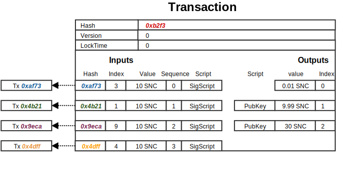
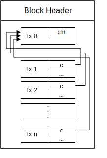
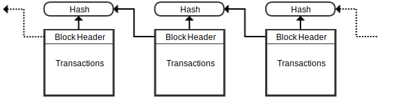

**********
Blockchain
**********

The following section covers data structures used in SonoCoin's blockchain.

.. note:: Sizes are measured in bytes.

Transactions
============

Transactions represent a blockchain state transition function. They are the only means to change the state of the blockchain and are consequently used to split coins, combine coins and reissue coins. 
Transactions in SonoCoin work similar to Bitcoin's. Each transaction contains a list of inputs and outputs. Transaction inputs reference and claim previous transaction outputs. Transaction outputs set up conditions for claiming ownership of the value held in them. 
The state transition specified by the transaction happens when the transaction is validated and added to a block.

The structure of a transaction can be seen in the following table.

.. table:: Transaction Data Structure

    +------+----------+---------------------+-----------------------------------------------------------------+
    | Size | Name     | Type                | Comment                                                         |
    +======+==========+=====================+=================================================================+
    | 32   | Hash     | [32]byte            | Hash of the transaction                                         |
    +------+----------+---------------------+-----------------------------------------------------------------+
    | 4    | Version  | uint32              | For forward compatibility (Current Version = 1)                 |
    +------+----------+---------------------+-----------------------------------------------------------------+
    | 4    | LockTime | uint32              | Time after which the transaction can be added to the blockchain |
    +------+----------+---------------------+-----------------------------------------------------------------+
    | var. | Inputs   | []TransactionInput  | Claimed transaction inputs                                      |
    +------+----------+---------------------+-----------------------------------------------------------------+
    | var. | Outputs  | []TransactionOutput | Spendable transaction outputs (UTXO)                            |
    +------+----------+---------------------+-----------------------------------------------------------------+

The following illustration shows an example transaction that takes 4 inputs and generates two outputs (excluding the commission output):

    An example of a SonoCoin transaction

Transaction Input
*****************

Transaction inputs reference a spendable transaction output (UTXO) captured in the transaction input outpoint data structure. Furthermore a script needs to be added with a valid signature allowing the party creating the transaction to claim the referenced UTXO.

.. table:: TransactionInput Data Structure

    +------+----------------+--------------------------+-----------------------------------------------------------------+
    | Size | Name           | Type                     | Comment                                                         |
    +======+================+==========================+=================================================================+
    | 44   | PreviousOutput | TransactionInputOutpoint | Reference to UTXO                                               |
    +------+----------------+--------------------------+-----------------------------------------------------------------+
    | 4    | Sequence       | uint32                   | The index of the specific input in the transaction              |
    +------+----------------+--------------------------+-----------------------------------------------------------------+
    | var. | Script         | []byte                   | Signature to verify public key ownership of the referenced UTXO |
    +------+----------------+--------------------------+-----------------------------------------------------------------+

Transaction Input Outpoint
++++++++++++++++++++++++++

Transaction input outpoints are references to previous transactions outputs. The reference is captured with a transaction hash, index of the to be claimed UTXO and the value contained in the UTXO.

.. table:: TransactionInputOutpoint Data Structure

    +------+--------+----------+-----------------------------------------------------+
    | Size | Name   | Type     | Comment                                             |
    +======+========+==========+=====================================================+
    | 32   | Hash   | [32]byte | The hash of the referenced transaction              |
    +------+--------+----------+-----------------------------------------------------+
    | 4    | Index  | uint32   | The index of the specific output in the transaction |
    +------+--------+----------+-----------------------------------------------------+
    | 8    | Value  | uint64   | UTXO value                                          |
    +------+--------+----------+-----------------------------------------------------+

Transaction Output
******************

.. table:: TransactionOutput Data Structure

    +------+--------+----------+-----------------------------------------------------+
    | Size | Name   | Type     | Comment                                             |
    +======+========+==========+=====================================================+
    | 4    | Index  | uint32   | Ordering parameter                                  |
    +------+--------+----------+-----------------------------------------------------+
    | 8    | Value  | uint64   | Transaction output value                            |
    +------+--------+----------+-----------------------------------------------------+
    | var. | Script | []byte   | Script defining conditions to claim this output     |
    +------+--------+----------+-----------------------------------------------------+
    | 32   | NodeID | [32]byte | Public key of node that wants to participate in PoS |
    +------+--------+----------+-----------------------------------------------------+

.. note:: the script field usually contains the public key of the new UTXO owner.

Commission Transaction
**********************

Every transaction in SonoCoin is subject to a commission that is used as an incentivization mechanism for the POS consensus algorithm. 
The first output of every transaction is defined to be a commission output spendable by whoever mines the block containing the transaction.
A valid commission output thus has an index of 0 and an empty script enabling the miner to claim the output.

When mining a block, a miner creates and adds an additional transaction to the block called the commission transaction that claims and combines all the commission outputs into a single utxo. The commission transaction is always added to the beginning of the transaction list.

    Illustration of how commission outputs are claimed by a miner in the commission transaction. **c** represents the commission amount (0.01 SNC)

Hash Calculation
****************

Transaction hashes are calculated using sha256(sha256(flatTx)), where flatTx stands for the flattened *Transaction* data structure (Excluding the Hash field). The flattened array of a transaction with one input and one output (excluding the commission output) is of the following form:

.. table:: Flattened data structure for a Transaction with one input and one output (excluding commission output)

    +------+----------+----------+------------+--------------+
    | Size | Name     | Type     | Endianness | Data Origin  |
    +======+==========+==========+============+==============+
    | 4    | Version  | uint32   | Little     | Transaction  |
    +------+----------+----------+------------+              +
    | 4    | LockTime | uint32   | Little     |              |
    +------+----------+----------+------------+--------------+
    | 32   | Hash     | [32]byte | n/a        | Transaction  |
    +------+----------+----------+------------+ Input        +
    | 4    | Index    | uint32   | Little     | Outpoint     |
    +------+----------+----------+------------+              +
    | 8    | Value    | uint64   | Little     |              |
    +------+----------+----------+------------+--------------+
    | 4    | Sequence | uint32   | Little     | Transaction  |
    +------+----------+----------+------------+ Input        +
    | var. | Script   | []byte   | n/a        |              |
    +------+----------+----------+------------+--------------+
    | 4    | Index    | uint32   | Little     | Transaction  |
    +------+----------+----------+------------+ Output       +
    | 8    | Value    | uint64   | Little     | (Commission) |
    +------+----------+----------+------------+--------------+
    | 4    | Index    | uint32   | Little     | Transaction  |
    +------+----------+----------+------------+ Output       +
    | 8    | Value    | uint64   | Little     |              |
    +------+----------+----------+------------+              +
    | var. | Script   | []byte   | n/a        |              |
    +------+----------+----------+------------+--------------+

Validation
**********

A transaction is considered valid if it satisfies the following conditions:

* The transaction contains at least one valid input and two outputs.
* The first output of the transaction has an empty Script and a value of 0.01 SNC (Commission Output).
* The input scripts are valid claims of the referenced transaction outputs.
* The sum of the input values is equal to the sum of output values.

Special cases
+++++++++++++

* The commission transaction only has one output that combines all the comission outputs of a block.
* The genesis transaction does not have any inputs.
 
Blocks
======

There are two types of blocks in SonoCoin:

- Normal blocks (Containing transactions)
- Epoch blocks

Both blocks share the same block header but use a different block body.

Block
*****

A block is a signed aggregation of transactions, that is linked to the previous block by a hash.

    Illustration of block ordering by hash linkage.

.. table:: Normal Block Data Structure

    +--------------+----------------+---------------+---------------------------------------------------------------------------------------+
    | Size         | Name           | Type          | Comment                                                                               |
    +==============+================+===============+=======================================================================================+
    | var.         | Header         | BlockHeader   | block header                                                                          |
    +--------------+----------------+---------------+---------------------------------------------------------------------------------------+
    | var.         | Transactions   | []Transaction | Block transactions, in format of "tx" command                                         |
    +--------------+----------------+---------------+---------------------------------------------------------------------------------------+

Epoch Block
+++++++++++

Epoch blocks are part of SonoCoin's PoS consensus algorithm. They hold a list of public keys called the advice list, that is used to determine the miners for the following epoch in sequential order. Epoch blocks themselves are not mined, but generated by each node independently. For further details please refer to :ref:`POS`.

.. table:: Epoch Block Data Structure

    +--------------+----------------+---------------+---------------------------------------------------------------------------------------+
    | Size         | Name           | Type          | Comment                                                                               |
    +==============+================+===============+=======================================================================================+
    | var.         | Header         | BlockHeader   | block header                                                                          |
    +--------------+----------------+---------------+---------------------------------------------------------------------------------------+
    | var.         | Advices        | [][32]byte    | List of public keys determining the miners of the following epoch in sequential order |
    +--------------+----------------+---------------+---------------------------------------------------------------------------------------+

Block Header
************

.. table:: Block Header Data Structure

    +-----------+-------------+--------------+-------------------------------------------------------------------------------------------------------+
    | Size      | Name        | Type         | Comment                                                                                               |
    +===========+=============+==============+=======================================================================================================+
    | 4         | Type        | uint32       | Block type (0 = Epoch block, 1 = Normal block)                                                        |
    +-----------+-------------+--------------+-------------------------------------------------------------------------------------------------------+
    | 32        | Hash        | [32]byte     | Block Hash                                                                                            |
    +-----------+-------------+--------------+-------------------------------------------------------------------------------------------------------+
    | 4         | Height      | uint32       | Height                                                                                                |
    +-----------+-------------+--------------+-------------------------------------------------------------------------------------------------------+
    | 8         | Size        | uint64       | Size                                                                                                  |
    +-----------+-------------+--------------+-------------------------------------------------------------------------------------------------------+
    | 4         | Version     | uint32       | For forward compatibility (Current Version = 1)                                                       |
    +-----------+-------------+--------------+-------------------------------------------------------------------------------------------------------+
    | 32        | PrevBlock   | [32]byte     | The hash value of the previous block this particular block references                                 |
    +-----------+-------------+--------------+-------------------------------------------------------------------------------------------------------+
    | 32        | MerkleRoot  | [32]byte     | The root hash of the merkle tree of all transactions / advice nodes                                   |
    +-----------+-------------+--------------+-------------------------------------------------------------------------------------------------------+
    | 4         | Timestamp   | uint32       | A timestamp recording when this block was created (Will overflow in 2106)                             |
    +-----------+-------------+--------------+-------------------------------------------------------------------------------------------------------+
    | 4         | Bits        | uint32       | Not Used                                                                                              |
    +-----------+-------------+--------------+-------------------------------------------------------------------------------------------------------+
    | 4         | Nonce       | uint32       | Not used                                                                                              |
    +-----------+-------------+--------------+-------------------------------------------------------------------------------------------------------+
    | 32        | Seed        | [32]byte     | Legacy part of PoS algorithm                                                                          |
    +-----------+-------------+--------------+-------------------------------------------------------------------------------------------------------+
    | 4         | TxnCount    | uint32       | Number of transactions contained in the block                                                         |
    +-----------+-------------+--------------+-------------------------------------------------------------------------------------------------------+
    | 4         | AdviceCount | uint32       | Number of advice nodes                                                                                |
    +-----------+-------------+--------------+-------------------------------------------------------------------------------------------------------+
    | var.      | Script      | []byte       | Node signature                                                                                        |
    +-----------+-------------+--------------+-------------------------------------------------------------------------------------------------------+

Hash Calculation
****************

Merkle Root Calculation
+++++++++++++++++++++++

.. note:: Will be specified soon.

Block Hash Calculation
++++++++++++++++++++++

.. note:: Will be specified soon.

Genesis Blocks and Transaction
==============================

SonoCoin's gensesis blocks are hard coded blocks that are used to kickstart the blockchain. In SonoCoin two such blocks need to be defined. The first block creates the total supply of 100,000,000 SNC and assigns them to a key pair. The second block is needed to kickstart the PoS algorithm with a list of advisors.

SonoCoins Genesis block is defined as follows:

.. table:: Genesis Block Header

    +---------------------------------+----------------------------------------------------------------------------------------------------------------------------------+
    | Parameter                       | Value                                                                                                                            |
    +=================================+==================================================================================================================================+
    | Type                            | 1                                                                                                                                |
    +---------------------------------+----------------------------------------------------------------------------------------------------------------------------------+
    | Hash                            | 114478c6875b7bfe44c9af34c2cf8e93043d59e76ee7180218c65bdc84c0dbcb                                                                 |
    +---------------------------------+----------------------------------------------------------------------------------------------------------------------------------+
    | Height                          | 1                                                                                                                                |
    +---------------------------------+----------------------------------------------------------------------------------------------------------------------------------+
    | Size                            | 592                                                                                                                              |
    +---------------------------------+----------------------------------------------------------------------------------------------------------------------------------+
    | Version                         | 1                                                                                                                                |
    +---------------------------------+----------------------------------------------------------------------------------------------------------------------------------+
    | PrevBlock                       | 0                                                                                                                                |
    +---------------------------------+----------------------------------------------------------------------------------------------------------------------------------+
    | MerkleRoot                      | 641693ef03a89b2fd0022ef794294f10be8d38f1c69dcae4ea813d6d0170d85e                                                                 |
    +---------------------------------+----------------------------------------------------------------------------------------------------------------------------------+
    | Timestamp                       | 1511859600                                                                                                                       |
    +---------------------------------+----------------------------------------------------------------------------------------------------------------------------------+
    | Bits                            | 0                                                                                                                                |
    +---------------------------------+----------------------------------------------------------------------------------------------------------------------------------+
    | Nonce                           | 0                                                                                                                                |
    +---------------------------------+----------------------------------------------------------------------------------------------------------------------------------+
    | Seed                            | (Empty)                                                                                                                          |
    +---------------------------------+----------------------------------------------------------------------------------------------------------------------------------+
    | TxnCount                        | 1                                                                                                                                |
    +---------------------------------+----------------------------------------------------------------------------------------------------------------------------------+
    | AdviceCount                     | 0                                                                                                                                |
    +---------------------------------+----------------------------------------------------------------------------------------------------------------------------------+
    | Script                          | []                                                                                                                               |
    +---------------------------------+----------------------------------------------------------------------------------------------------------------------------------+

The genesis block consists of a single transaction with no input but one output of 100'000'000 SonoCoins to the following Key Pair:

.. table:: Genesis Key Pair

    +-------------+----------------------------------------------------------------------------------------------------------------------------------+
    | Parameter   | Value                                                                                                                            |
    +=============+==================================================================================================================================+
    | Private Key | 4a9c464e848424c9197e09b85ed47a51d2c07cc43a6b923c9a805686a59b311f                                                                 |
    +-------------+----------------------------------------------------------------------------------------------------------------------------------+
    | Public Key  | b2d29213085e152ec752ff87f1a61cba9523997bfbc9021e7d08a401e31659af                                                                 |
    +-------------+----------------------------------------------------------------------------------------------------------------------------------+

Genesis Epoch
*************

After the genesis block is created a gensis epoch is defined by adding an additional Epoch block. The genesis epoch block header is specified in the following table:

.. table:: Genesis Epoch Block Header

    +---------------------------------+----------------------------------------------------------------------------------------------------------------------------------+
    | Parameter                       | Value                                                                                                                            |
    +=================================+==================================================================================================================================+
    | Type                            | 0                                                                                                                                |
    +---------------------------------+----------------------------------------------------------------------------------------------------------------------------------+
    | Hash                            | cda2ebb07d5224b572723af96cf937e8f2c317bd2e2a585d4e3c7a7d93e2a6ef                                                                 |
    +---------------------------------+----------------------------------------------------------------------------------------------------------------------------------+
    | Height                          | 2                                                                                                                                |
    +---------------------------------+----------------------------------------------------------------------------------------------------------------------------------+
    | Size                            | 49611                                                                                                                            |
    +---------------------------------+----------------------------------------------------------------------------------------------------------------------------------+
    | Version                         | 1                                                                                                                                |
    +---------------------------------+----------------------------------------------------------------------------------------------------------------------------------+
    | PrevBlock                       | 114478c6875b7bfe44c9af34c2cf8e93043d59e76ee7180218c65bdc84c0dbcb                                                                 |
    +---------------------------------+----------------------------------------------------------------------------------------------------------------------------------+
    | MerkleRoot                      | 01a4cbcf526be3f153b1dea54cdf3a8f5752a4e35c2c380e9a94f17efc08a4fa                                                                 |
    +---------------------------------+----------------------------------------------------------------------------------------------------------------------------------+
    | Timestamp                       | 1511952548                                                                                                                       |
    +---------------------------------+----------------------------------------------------------------------------------------------------------------------------------+
    | Bits                            | 0                                                                                                                                |
    +---------------------------------+----------------------------------------------------------------------------------------------------------------------------------+
    | Nonce                           | 0                                                                                                                                |
    +---------------------------------+----------------------------------------------------------------------------------------------------------------------------------+
    | Seed                            | (empty)                                                                                                                          |
    +---------------------------------+----------------------------------------------------------------------------------------------------------------------------------+
    | TxnCount                        | 0                                                                                                                                |
    +---------------------------------+----------------------------------------------------------------------------------------------------------------------------------+
    | AdviceCount                     | 600                                                                                                                              |
    +---------------------------------+----------------------------------------------------------------------------------------------------------------------------------+
    | Script                          | []                                                                                                                               |
    +---------------------------------+----------------------------------------------------------------------------------------------------------------------------------+

The genesis Epoch block body contains a list of 600 identical advisors. The public key of the advisor can be found in the following list:

.. code-block:: json

    [
        64b8f1da790f5f1fe2e8dce38c3b9e99752b6fe8325693f4909e4203eadcdc92, // 1.
        64b8f1da790f5f1fe2e8dce38c3b9e99752b6fe8325693f4909e4203eadcdc92, // 2.
        ...
        64b8f1da790f5f1fe2e8dce38c3b9e99752b6fe8325693f4909e4203eadcdc92  // 600.
    ]
