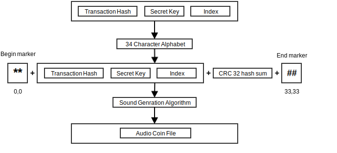

****
Coin
****

In SonoCoin value is often transferred by sharing a special data structure with a recipient. This data structure is aptly called a coin.
A coin is made up of the following elements:

+------+--------+----------+--------------------------+
| Size | Name   | Type     | Comment                  |
+======+========+==========+==========================+
| 64   | Key    | [64]byte | Private key for a utxo   |
+------+--------+----------+--------------------------+
| 32   | TxHash | [32]byte | hash of the transaction  |
+------+--------+----------+--------------------------+
| 4    | Index  | uint32   | Index of the utxo        |
+------+--------+----------+--------------------------+

Coin Reissuance
***************

When a coin is transmitted from one user to another, the private key is shared between the users which causes a race condition. The recipient has to *reissue* their coin to make the transfer final. This is done by creating a new key pair and issuing a transaction that spends the UTXO associated with the private key to the generated public key. 

Coin Transfer
*************

Coins can be transmitted between SonoCoin clients by a variety of methods (Sound, Light, QR-Code). The following illustration shows how SonoCoin's mobile clients create the sound file.

    A simplified view of the SonoCoin sound generation algorithm.
