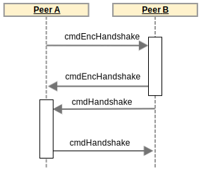
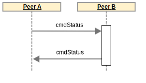

.. _Rlpx: https://github.com/ethereum/devp2p/blob/master/rlpx.md
.. _Kademlia: https://pdos.csail.mit.edu/~petar/papers/maymounkov-kademlia-lncs.pdf
.. _`SonoCoin Bootstrapping API`: https://explorer.sono.money/docs/api/v1/info

***
P2P
***

This section describes how peers are discovered in the SonoCoin network and how information is shared between nodes.
SonoCoin's P2P network layer is based on Ethereum's well established RLPx_ protocol and can be divided into the following three parts:

* Discovery Protocol (UDP)
* Base Protocol (TCP)
* SonoCoin Protocol (Base Protocol)

Any number of protocols can be built on top of the base protocol and can be used side by side with the SonoCoin Protocol.

Discovery Protocol
==================

SonoCoin uses a variant of the Kademlia_ distributed hash table (DHT) to form a structured p2p overlay network. This UDP based DHT represents the base layer of the SonoCoin network, allowing for a highly scalable (:math:`O(\log{}n)` for node lookup and space complexity) and general decentralized network infrastructure.

The following table summarizes the parametrization of Kademlia used in SonoCoin's reference implementation:

+--------------------------------------+-------+
| Parameter Name                       | Value |
+======================================+=======+
| hash bits                            | 256   |
+--------------------------------------+-------+
| k (bucket size)                      | 16    |
+--------------------------------------+-------+
| α (Concurrency Factor)               | 3     |
+--------------------------------------+-------+

For node distance calculations using Kademlia's XOR metric the sha256 hash of the nodeID is used.

Packet header
*************

All packets are prefixed with a header of the following structure:

.. table:: Discovery Packet Header

    +------+-------------+-------------+---------------------------------------------+
    | Size | Name        | Type        | comment                                     |
    +======+=============+=============+=============================================+
    | 32   | PublicKey   | [32]byte    | The node's public key                       |
    +------+-------------+-------------+---------------------------------------------+
    | 64   | signature   | [64]byte    | sig(packet-type \|\| packet-data)           |
    +------+-------------+-------------+---------------------------------------------+
    | 1    | packetType  | uint        | packet identifier                           |
    +------+-------------+-------------+---------------------------------------------+

.. note:: The \|\| operator stands for concatenation 

Data Structures
***************

The following data structure will be reused in the packet definitions:

.. table:: rpcEndpoint data structure

    +--------+-----------+--------+-------------------------------------------+
    | Size   | Name      | Type   | Comment                                   |
    +========+===========+========+===========================================+
    | 4 / 16 | IPAddress | []byte | Little endian encoded IPV4 / IPV6 address |
    +--------+-----------+--------+-------------------------------------------+
    | 2      | UDP       | uint16 | UDP port number                           |
    +--------+-----------+--------+-------------------------------------------+
    | 2      | TCP       | uint16 | TCP port number                           |
    +--------+-----------+--------+-------------------------------------------+

Packet Types
************

SonoCoin's discovery protocol defines the following 4 RPC packet types. Packet size is limited to 1280 bytes. Larger packets are discarded.

All packet contents are serialized using :ref:`Recursive Length Prefix (RLP)` encoding.

Ping Packet (packet-type = 0x01)
++++++++++++++++++++++++++++++++

+------------+-------------+--------------------------+---------------------------------------------------------+
| Size       | Name        | Type                     | comment                                                 |
+============+=============+==========================+=========================================================+
| 4          | Version     | uint32                   | For Forward compatibility (Current Version = 1)         |
+------------+-------------+--------------------------+---------------------------------------------------------+
| 8 / 20     | From        | rpcEndpoint              |                                                         |
+------------+-------------+--------------------------+---------------------------------------------------------+
| 8 / 20     | To          | rpcEndpoint              |                                                         |
+------------+-------------+--------------------------+---------------------------------------------------------+
| 8          | Expiration  | uint64                   | Unix timestamp after which packet is considered expired |
+------------+-------------+--------------------------+---------------------------------------------------------+

..
    Example Packet (UDP-Payload)
    ############################
    .. raw:: html
    

    64 b8 f1 da 79 0f 5f 1f e2 e8 dc e3 8c 3b 9e 99 75 2b 6f e8 32 56 93 f4 90 9e 42 03 ea dc dc 92 
Node Public Key

    ea 58 35 87 06 da 46 6a b7 61 4e 10 76 af b7 00 9e ab ef 09 6f 86 47 40 a6 02 21 7a 85 97 d7 2f 5e 9a bc a4 84 ba 1b 4b 83 b3 8b 86 02 06 94 e1 06 1b 7a 5e d5 9a 24 06 1e 4f 41 92 42 f0 19 02 
Packet Signature

    01 
Packet Type

    dc 01 cb 84 8a c9 7f 4d 82 23 82 82 23 82 c9 84 b2 c5 e7 cf 82 18 3f 80 84 5b 7f d9 e6  
RLP-Encoded Ping data

    

     

Pong Packet (packet-type = 0x02)
++++++++++++++++++++++++++++++++

+--------+------------+-------------+---------------------------------------------------------+
| Size   | Name       | Type        | comment                                                 |
+========+============+=============+=========================================================+
| 8 / 20 | To         | rpcEnpoint  |                                                         |
+--------+------------+-------------+---------------------------------------------------------+
| 32     | ping-hash  | [32]byte    | hash of corresponding ping packet                       |
+--------+------------+-------------+---------------------------------------------------------+
| 8      | Expiration | uint64      | Unix timestamp after which packet is considered expired |
+--------+------------+-------------+---------------------------------------------------------+

FindNode Packet (packet-type = 0x03)
++++++++++++++++++++++++++++++++++++

+------+------------+-------------+---------------------------------------------------------+
| Size | Name       | Type        | comment                                                 |
+======+============+=============+=========================================================+
| 32   | Target     | [32]byte    | The identifier of the node                              |
+------+------------+-------------+---------------------------------------------------------+
| 8    | Expiration | uint64      | Unix timestamp after which packet is considered expired |
+------+------------+-------------+---------------------------------------------------------+

Neighbors Packet (packet-type = 0x04)
+++++++++++++++++++++++++++++++++++++

+--------+------------+---------------+---------------------------------------------------------+
| Size   | Name       | Type          | comment                                                 |
+========+============+===============+=========================================================+
| var.   | Nodes      | []rpcEndpoint |                                                         |
+--------+------------+---------------+---------------------------------------------------------+
| 8      | Expiration | uint64        | Unix timestamp after which packet is considered expired |
+--------+------------+---------------+---------------------------------------------------------+

Neighbors packets are split up into multiple packets to stay below the 1280 byte limit. 

Base Protocol
=============

The TCP-based base protocol is used to authenticate nodes and upgrade to a higher layer protocol (eg. SonoCoin Protocol).

Message structure
*****************

All messages are structured as follows:

+------+-------------+-----------+------------------------------------------+
| Size | Name        | Type      | Comment                                  |
+======+=============+===========+==========================================+
| 3    | StartSymbol | [3]byte   | [0x73, 0x63, 0x6d] ("scm")               |
+------+-------------+-----------+------------------------------------------+
| 4    | Magic       | uint32    | 1 = MainNet, 2 = TestNet                 |
+------+-------------+-----------+------------------------------------------+
| 8    | Command     | uint64    | command                                  |
+------+-------------+-----------+------------------------------------------+
| 8    | Length      | uint64    | Length of payload in number of bytes     |
+------+-------------+-----------+------------------------------------------+
| 4    | Checksum    | uint32    | First 4 bytes of sha256(sha256(payload)) |
+------+-------------+-----------+------------------------------------------+
| 16   | UUID        | [16]byte  | Unique Packet Identifier                 |
+------+-------------+-----------+------------------------------------------+
| var. | Payload     | []byte    | Payload Data                             |
+------+-------------+-----------+------------------------------------------+

Available Commands
******************

+--------------------+------------+
| Command Name       | Command ID | 
+====================+============+
| cmdEncHandshake    | 0x00       |
+--------------------+------------+
| cmdHandshake       | 0x01       |
+--------------------+------------+
| cmdDisc            | 0x02       |
+--------------------+------------+
| cmdPing            | 0x03       |
+--------------------+------------+
| cmdPong            | 0x04       |
+--------------------+------------+

Handshakes
**********

After a peer is discovered by the discovery protocol, two handshakes are performed to authenticate peers and communicate protocol capabilities. The described process is illustrated in the following sequence diagram:

    The base protocol handshaking process.

Data Structures
***************

The following data structure will be reused in the packet definitions:

.. table:: Cap data structure

    +------+-----------+--------+--------------------------------------------------+
    | Size | Name      | Type   | Comment                                          |
    +======+===========+========+==================================================+
    | var. | Name      | string | Protocol name ("SNC" for SonoCoin Protocol)      |
    +------+-----------+--------+--------------------------------------------------+
    | 4    | Version   | uint32 | For forward Compatibility (current version = 1 ) |
    +------+-----------+--------+--------------------------------------------------+

Commands in Detail
******************

cmdEncHandshake
+++++++++++++++

The Encryption Handshake (0x00) authenticates the nodes and establishes a shared secret between them.

.. warning:: Shared secret isn't used for encrypted communication yet.

The payload is different for the initiating peer and the target peer.

Request Payload
###############

The initiator generates a random key pair and a random nonce and signs the nonce with the generated private key. 

.. .. warning:: Seems to be different from ethereums implementation. Try to figure out https://github.com/ethereumproject/go-ethereum/wiki/RLPx-Encryption

+------+-----------------+----------+-------------------------------------------------+
| Size | Name            | Type     | comment                                         |
+======+=================+==========+=================================================+
| 64   | Signature       | [64]byte | Signed Nonce                                    |
+------+-----------------+----------+-------------------------------------------------+
| 32   | InitiatorPubKey | [32]byte | Randomly generated public key                   |
+------+-----------------+----------+-------------------------------------------------+
| 32   | Nonce           | [32]byte | Randomly generated nonce                        |
+------+-----------------+----------+-------------------------------------------------+
| 4    | Version         | uint32   | For forward compatibility (Current Version = 1) |
+------+-----------------+----------+-------------------------------------------------+

Response Payload
################

+------+-----------------+----------+-------------------------------------------------+
| Size | Name            | Type     | comment                                         |
+======+=================+==========+=================================================+
| 32   | random_pub_key  | [32]byte | Randomly generated public key                   |
+------+-----------------+----------+-------------------------------------------------+
| 32   | Nonce           | [32]byte | Randomly generated nonce                        |
+------+-----------------+----------+-------------------------------------------------+
| 4    | Version         | uint32   | For forward compatibility (Current Version = 1) |
+------+-----------------+----------+-------------------------------------------------+

cmdHandshake
++++++++++++

The protocol handshake (0x01) determines the capability of the nodes and is the same for the initiator and the target.

+------+------------+----------+---------+
| Size | Name       | Type     | comment |
+======+============+==========+=========+
| 32   | NodeID     | [32]byte |         |
+------+------------+----------+---------+
| 8    | Version    | uint64   |         |
+------+------------+----------+---------+
| var. | Name       | string   |         |
+------+------------+----------+---------+
| var. | Caps       | []Cap    |         |
+------+------------+----------+---------+
| 8    | ListenPort | uint64   |         |
+------+------------+----------+---------+

cmdDisc
+++++++

cmdDisc is used when disconnecting from a peer. It lets the peer know why the TCP connection will be dropped.

+------+--------+--------+-----------------------------------------------------------------------+
| Size | Name   | Type   | comment                                                               |
+======+========+========+=======================================================================+
| 4    | Reason | uint32 | Reason for disconnecting. Valid reasons Listed in the following table |
+------+--------+--------+-----------------------------------------------------------------------+

Reason List
###########

+-------------------------+------+-------------+
| Name                    | Code | Description |
+=========================+======+=============+
| DiscRequested           | 0x00 |             |
+-------------------------+------+-------------+
| DiscNetworkError        | 0x01 |             |
+-------------------------+------+-------------+
| DiscProtocolError       | 0x02 |             |
+-------------------------+------+-------------+
| DiscUselessPeer         | 0x03 |             |
+-------------------------+------+-------------+
| DiscTooManyPeers        | 0x04 |             |
+-------------------------+------+-------------+
| DiscAlreadyConnected    | 0x05 |             |
+-------------------------+------+-------------+
| DiscIncompatibleVersion | 0x06 |             |
+-------------------------+------+-------------+
| DiscInvalidIdentity     | 0x07 |             |
+-------------------------+------+-------------+
| DiscQuitting            | 0x08 |             |
+-------------------------+------+-------------+
| DiscUnexpectedIdentity  | 0x09 |             |
+-------------------------+------+-------------+
| DiscSelf                | 0x0a |             |
+-------------------------+------+-------------+
| DiscReadTimeout         | 0x0b |             |
+-------------------------+------+-------------+
| DiscSubprotocolError    | 0x10 |             |
+-------------------------+------+-------------+

.. warning:: TODO: define which disconnect reason is used when.

cmdPing
+++++++

No payload.

cmdPong
+++++++

Response to ping. No payload.

SonoCoin Protocol V1
====================

The SonoCoin Protocol defines how blockchain related information is exchanged.
Nodes that implement Version 1 of the SonoCoin protocol communicate this, by adding ["SNC",1] to their capability list in the base protocol handshake.

Available Commands
******************

+--------------------+------------+
| Command Name       | Command ID | 
+====================+============+
| cmdStatus          | 0x10       |
+--------------------+------------+
| cmdPing            | 0x11       |
+--------------------+------------+
| cmdPong            | 0x12       |
+--------------------+------------+
| cmdMsg             | 0x13       |
+--------------------+------------+
| cmdTx              | 0x14       |
+--------------------+------------+
| cmdNewBlockHashes  | 0x15       |
+--------------------+------------+
| cmdGetBlockHeaders | 0x16       |
+--------------------+------------+
| cmdBlockHeaders    | 0x17       |
+--------------------+------------+
| cmdGetBlockBodies  | 0x18       |
+--------------------+------------+
| cmdBlockBodies     | 0x19       |
+--------------------+------------+
| cmdNewBlock        | 0x1a       |
+--------------------+------------+
| cmdGetNodeData     | 0x1d       |
+--------------------+------------+
| cmdGetReceipts     | 0x1f       |
+--------------------+------------+

Handshake
*********

The SonoCoin Protocol Handshake involves both peers sending a cmdStatus (0x00) Message that communicates the current state of each peer's blockchain. The process is illustrated in the following sequence diagram:

    The SonoCoin protocol handshake.

Peers that haven't partaken in a handshake but send commands from the SonoCoin Protocol should be dropped (cmdDisc 0x02).

Commands in Detail
******************

cmdStatus
+++++++++

Handshake for the SonoCoin Protocol. Informs peer of blockchain state.

+------+-----------------+----------+--------------------------------------------------+
| Size | Name            | Type     | Comment                                          |
+======+=================+==========+==================================================+
| 4    | ProtocolVersion | uint32   | For forward compatibility (Current version = 1 ) |
+------+-----------------+----------+--------------------------------------------------+
| 8    | NetworkID       | uint64   | Mainnet = 1, Testnet = 2                         |
+------+-----------------+----------+--------------------------------------------------+
| 32   | CurrentBlock    | [32]byte | Hash of last known block in local blockchain     |
+------+-----------------+----------+--------------------------------------------------+
| 32   | GenesisBlock    | [32]byte | Hash of genesis block in local blockchain        |
+------+-----------------+----------+--------------------------------------------------+

cmdPing
+++++++

No Payload.

cmdPong
+++++++

Response to cmdPing. No Payload.

cmdMsg
++++++

Sends a plain text message.

+------+------+----------+---------+
| Size | Name | Type     | Comment |
+======+======+==========+=========+
| var. | Name | string   |         |
+------+------+----------+---------+

cmdTx
+++++

Notifies peer of uncofirmed transactions.

+------+------+-----------------+---------+
| Size | Name | Type            | Comment |
+======+======+=================+=========+
| var. | Txs  | []Transaction   |         |
+------+------+-----------------+---------+

cmdNewBlockHashes
+++++++++++++++++

Announces the availability of a number of blocks through a hash notification.

+------+-----------------+------------------------+---------+
| Size | Name            | Type                   | Comment |
+======+=================+========================+=========+
| var. | NewBlockHashes  | []newBlockHashesData   |         |
+------+-----------------+------------------------+---------+

The newBlockHashesData type is defined as follows:

+------+--------+----------+---------+
| Size | Name   | Type     | Comment |
+======+========+==========+=========+
| 32   | Hash   | [32]byte |         |
+------+--------+----------+---------+
| 4    | Height | uint32   |         |
+------+--------+----------+---------+

cmdGetBlockHeaders
++++++++++++++++++

Requests block headers starting at hash or height.

+--------+---------+-------------------+-------------------------------------------------------------+
| Size   | Name    | Type              | Comment                                                     |
+========+=========+===================+=============================================================+
| 32 / 4 | Origin  | [32]byte / uint32 | Block hash or block height                                  |
+--------+---------+-------------------+-------------------------------------------------------------+
| 4      | Amount  | uint32            | Amount of blocks                                            |
+--------+---------+-------------------+-------------------------------------------------------------+
| 4      | Skip    | uint32            | Amount of block to skip after origin                        |
+--------+---------+-------------------+-------------------------------------------------------------+
| 1      | Reverse | bool              | Block header order (1 = towards genesis, 0 = towards leaf ) |
+--------+---------+-------------------+-------------------------------------------------------------+

.. note:: currently in the json version "reverse": true, "reverse": false instead of 1, 0

cmdBlockHeaders
+++++++++++++++

Reply to cmdGetBlockHeaders

+------+----------------+---------------+---------+
| Size | Name           | Type          | Comment |
+======+================+===============+=========+
| var. | blockHeaders   | []BlockHeader |         |
+------+----------------+---------------+---------+

cmdGetBlockBodies
+++++++++++++++++

Requests block bodies specified by a list of hashes.

+------+----------------+------------+--------------+
| Size | Name           | Type       | Comment      |
+======+================+============+==============+
| var. | hashes         | [][32]byte | Block hashes |
+------+----------------+------------+--------------+

cmdBlockBodies
++++++++++++++

Reply to cmdGetBlockBodies.

+------+---------+-----------------+---------+
| Size | Name    | Type            | Comment |
+======+=========+=================+=========+
| var. | blocks  | []Block         |         |
+------+---------+-----------------+---------+

cmdNewBlock
+++++++++++

cmdNewBlock propagates a newly discovered block to a remote peer.

+------+-------+-----------------+---------+
| Size | Name  | Type            | Comment |
+======+=======+=================+=========+
| var. | block | Block           |         |
+------+-------+-----------------+---------+

cmdGetNodeData
++++++++++++++

.. warning:: not implemented!

cmdGetReceipts
++++++++++++++

.. warning:: not implemented!

.. 
    .. annohex::
        :octets: edcf5bbd5c0ac63760111db5cd32dd48937b6223d5e6df0b362d1c413eeb3780 3c0267c062bc1c5a3bb718fbd16c4a9804a6ade583fa94d5ea562f6087207d3f24f688974f2a30f8e16aa706c919559a0450466120dd5f56beb2a96bf55e4a06 01e801d79000000000000000000000000000000000 822382 822382 c9 848ac97f4d 822382 80 845b7fbc58
        :tooltips: `public key node` `Signature` `Packet Type` `RLP: List 40` `Version` `List 23` `IP` `UDP` `TCP` `List 9` `IP` `UDP` `TCP` `Time Stamp`

.. 
    .. container:: toggle
        .. container:: header
            **Concrete type defenition in golang reference implementation**
        .. code-block:: go
            :linenos:
            type Message struct {
                ReceivedAt time.Time
                Magic      uint32    `json:"magic"`    // main, testnet, testnet3, namecoin
                Command    uint64    `json:"command"`  // command
                Length     uint64    `json:"length"`   // Length of payload in number of bytes
                Checksum   uint32    `json:"checksum"` // First 4 bytes of sha256(sha256(payload))
                UUID       [16]byte  `json:"uuid"`
                Payload    io.Reader `json:"payload"` // Data
            }

Node Bootstrapping
==================

A new node wanting to join the network needs at least one seed node to connect to. It is recommended to optain seed nodes in one of the following ways:

* Receiving a list of seed nodes from a trusted source and connecting to them directly.
* Calling the SonoCoin bootstrap API (https://api.sono.money/v1/nodes).